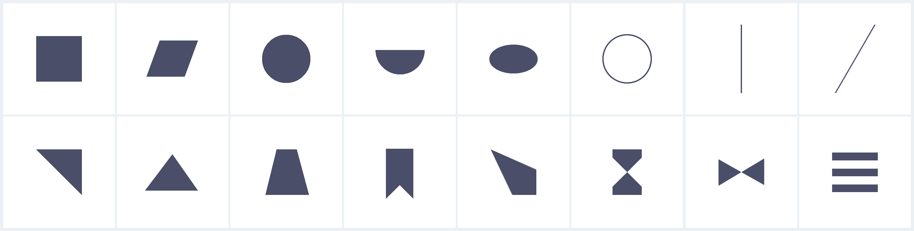

# Gradient Shapes
Shapes generated with CSS background gradients.



[https://yuanchuan.name/gradient-shapes/](https://yuanchuan.name/gradient-shapes/)

## Build


```js
$ ./bin/generate shapes index.html
```

Or just

```bash
$ make
```

